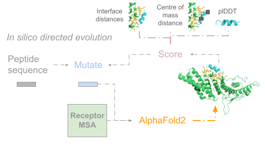
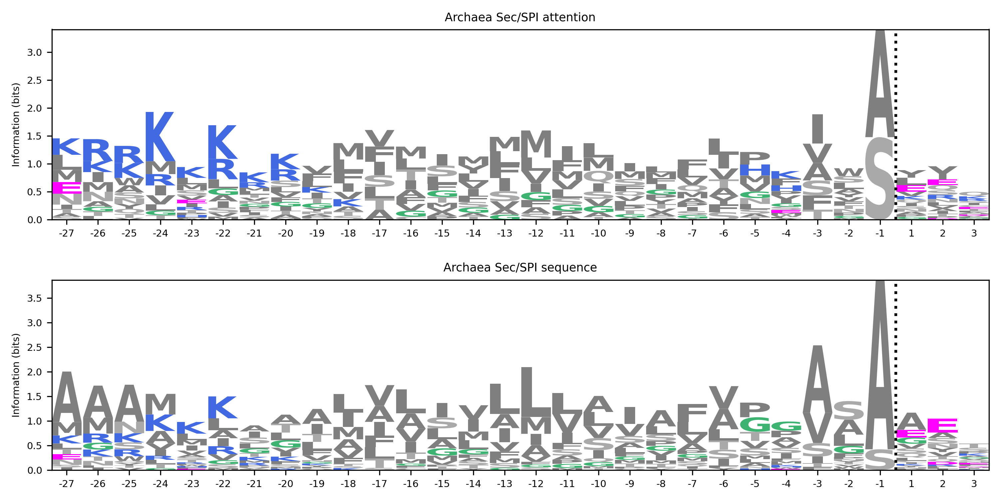
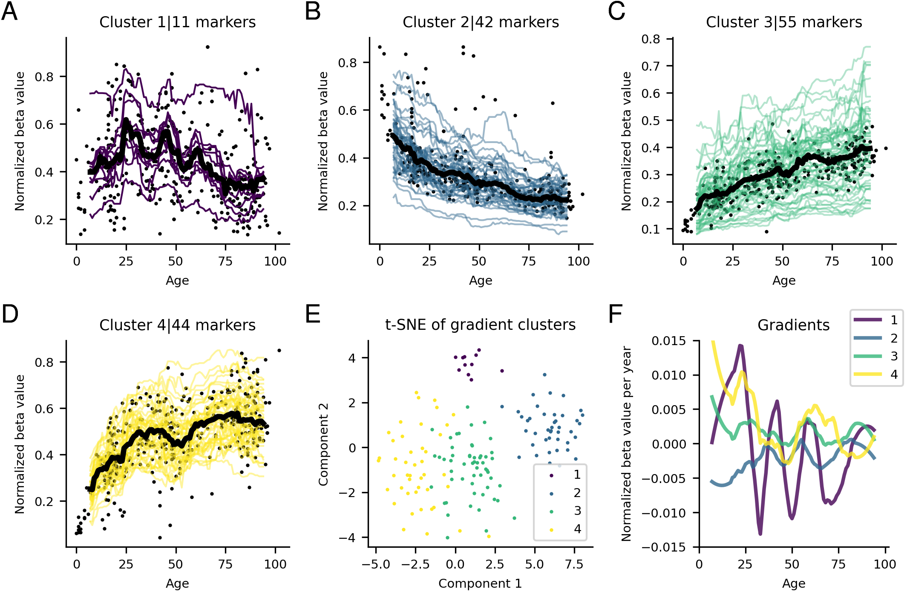
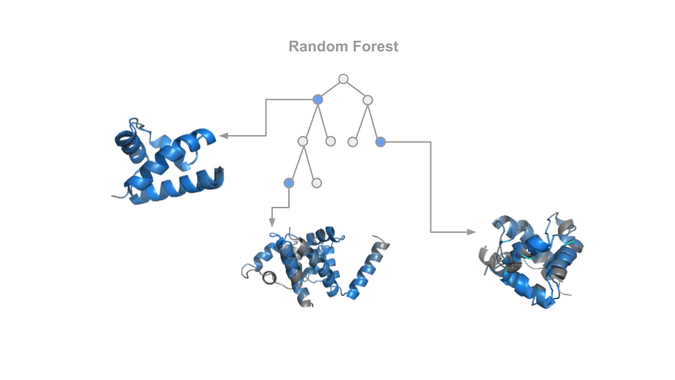
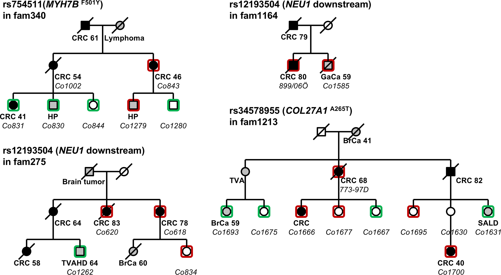

My research is about creating useful methods for biological applications and finding hidden relationships in biological data using statistical methods and deep learning.

 

 

 

# Protein complex prediction

<a href="https://www.nature.com/articles/s41467-022-33729-4"> Bryant, P., Pozzati, G., Zhu, W. et al. Predicting the structure of large protein complexes using AlphaFold and Monte Carlo tree search. Nat Commun 13, 6028 (2022).

<a href="https://www.nature.com/articles/s41467-022-28865-w"> Bryant P, Pozzati G, Elofsson A. Improved prediction of protein-protein interactions using AlphaFold2. Nat Commun. 2022;13: 1–11.

<a href="https://www.biorxiv.org/content/10.1101/2021.11.08.467664v1 "> David F Burke, Patrick Bryant et al. Towards a structurally resolved human protein
interaction network. bioRxiv. 2021. p. 2021.11.09. doi: https://doi.org/10.1101/2021.11.08.467664.

<a href="https://www.nature.com/articles/s41594-022-00849-w"> Akdel M, Pires DEV, Pardo EP, Jänes J, Zalevsky AO, Mészáros B, Bryant P et al. A structural biology community assessment of AlphaFold2 applications. Nat Struct Mol Biol 29, 1056–1067 (2022). https://doi.org/10.1038/s41594-022-00849-w

 

# Protein design

<a href="https://www.biorxiv.org/content/10.1101/2022.07.23.501214v1.full.pdf"> Bryant P, Elofsson A. EvoBind: in silico directed evolution of peptide binders with AlphaFold. bioRxiv. 2022. p. 2022.07.23.501214. doi:10.1101/2022.07.23.501214

 

# Signal peptides

<a href="https://www.mlsb.io/papers_2021/MLSB2021_Studying_signal_peptides_with.pdf"> Bryant P, Elofsson A. Studying signal peptides with attention neural networks informs cleavage site predictions. MLSB Workshop at NeurIPS 2021

 
# Epigenetics and ageing

<a href="https://academic.oup.com/nargab/article/4/1/lqac001/6520111?login=true">Bryant P, Elofsson A. 2021. The relationship between ageing and changes in the human blood and brain methylomes. NAR Genomics and Bioinformatics, Volume 4, Issue 1, March 2022 </a>

 

# COVID-19 (SARS-CoV-2)

<a href="https://peerj.com/articles/9879/">Bryant P, Elofsson A. 2020. Estimating the impact of mobility patterns on COVID-19 infection rates in 11 European countries. PeerJ 8:e9879 https://doi.org/10.7717/peerj.9879</a>

<a href="https://www.medrxiv.org/content/10.1101/2020.08.14.20175240v1.full.pdf+html">Bryant P, Elofsson A. 2020. The limits of estimating COVID-19 intervention effects using Bayesian models (preprint). medRxiv</a>

 
# Protein Evolution

<a href="https://www.sciencedirect.com/science/article/pii/S0022283620303703?via%3Dihub">Bryant P, Elofsson A. 2020. Decomposing Structural Response Due to Sequence Changes in Protein Domains with Machine Learning. Journal of Molecular Biology, Volume 432, Issue 16 https://doi.org/10.1016/j.jmb.2020.05.021 </a>

 
# Familial Cancer

[A Swedish Genome-Wide Haplotype Association Analysis Identifies a Novel Breast Cancer Susceptibility Locus in 8p21.2 and Characterizes Three Loci on Chromosomes 10, 11 and 16]

[Linkage Analysis Revealed Risk Loci on 6p21 and 18p11.2-q11.2 in Familial Colon and Rectal Cancer, Respectively.” European Journal of Human Genetics: EJHG 27 (8): 1286–95.]

[Recurrent, Low-Frequency Coding Variants Contributing to Colorectal Cancer in the Swedish Population. PloS One 13 (3): e0193547.]

[Code for analysis of Next Generation Sequencing data.]

[Code for analysis of Next Generation Sequencing data.]:https://github.com/patrickbryant1/CMM

[A Swedish Genome-Wide Haplotype Association Analysis Identifies a Novel Breast Cancer Susceptibility Locus in 8p21.2 and Characterizes Three Loci on Chromosomes 10, 11 and 16]:https://www.mdpi.com/2072-6694/14/5/1206

[Linkage Analysis Revealed Risk Loci on 6p21 and 18p11.2-q11.2 in Familial Colon and Rectal Cancer, Respectively.” European Journal of Human Genetics: EJHG 27 (8): 1286–95.]:https://www.nature.com/articles/s41431-019-0388-3

[Recurrent, Low-Frequency Coding Variants Contributing to Colorectal Cancer in the Swedish Population. PloS One 13 (3): e0193547.]:https://journals.plos.org/plosone/article?id=10.1371/journal.pone.0193547
